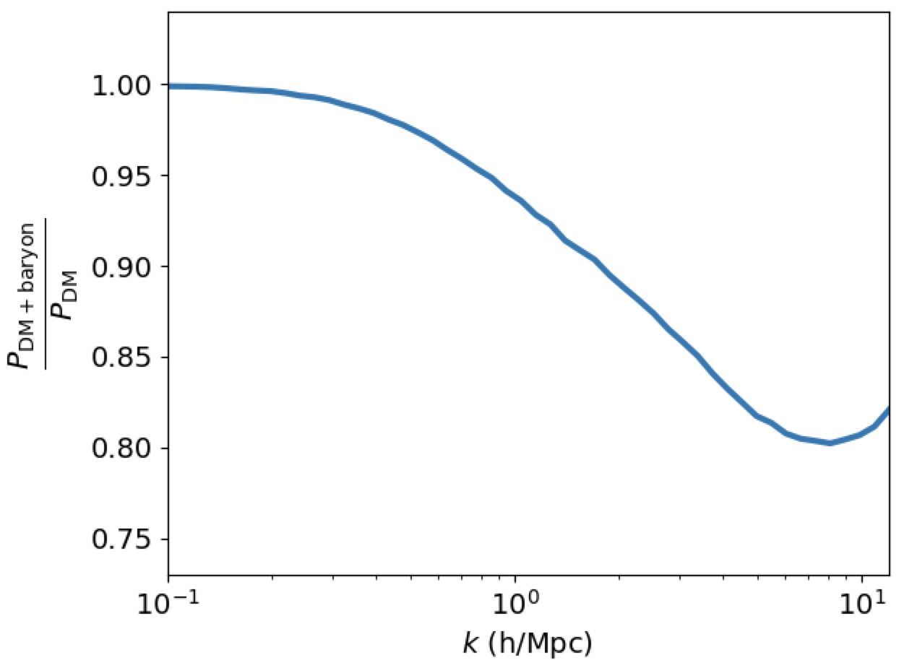
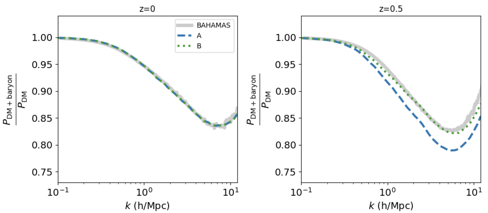

# BCemu

[](https://github.com/sambit-giri/BCemu/blob/master/LICENSE)
[](https://github.com/sambit-giri/BCemu)

[](https://badge.fury.io/py/BCemu)

A Python package for modelling baryonic effects in cosmological simulations.

## Package details

The package provides emulators to model the suppression in the power spectrum due to baryonic feedback processes. These emulators are based on the baryonification model ([Schneider et al. 2019](#1)), where gravity-only *N*-body simulation results are manipulated to include the impact of baryonic feedback processes. For a detailed description, see [Giri & Schneider (2021)](#2).

## INSTALLATION

One can install a stable version of this package using pip by running the following command::

    pip install BCemu

In order to use the latest version, one can clone this package running the following::

    git clone https://github.com/sambit-giri/BCemu.git

To install the package in the standard location, run the following in the root directory::

    python setup.py install

In order to install it in a separate directory::

    python setup.py install --home=directory

One can also install it using pip by running the following command::

    pip install git+https://github.com/sambit-giri/BCemu.git

The core dependencies are installed automatically. Some features require optional packages:

- **BCemu2025 — differentiable backends** (default is `numpy`, no extra install needed):
  ```
  pip install jax flax     # for backend='jax'  (CPU/GPU/TPU, differentiable via jax.grad)
  pip install torch        # for backend='torch' (differentiable via autograd)
  ```

- **BCemu2021 emulators** (`BCM_7param` / `BCM_3param`):
  ```
  pip install smt==1.0.0
  ```
  A clear error message is shown if you try to use these emulators without `smt` installed.

### Tests

For testing, use [pytest](https://docs.pytest.org/en/stable/), which can be installed via pip. Tests are split by emulator version so you only download what you need:

| Test file | Marker | What it tests |
|-----------|--------|---------------|
| `tests/test_BCemu2021.py` | `bcemu2021` | BCM 7-param and 3-param emulators (BCemu2021) |
| `tests/test_BCemu2025.py` | `bcemu2025` | JAX, numpy, and torch backends (BCemu2025) |

Run all tests:

    python -m pytest tests

Run tests for one emulator only (avoids downloading the other):

    python -m pytest tests -m bcemu2021
    python -m pytest tests -m bcemu2025

## 📖 Citation

If you use `BCemu` in your research, please cite the following paper:

> Giri, S. K., & Schneider, A. (2021). Emulation of baryonic effects on the matter power spectrum and constraints from galaxy cluster data. Journal of Cosmology and Astroparticle Physics, 2021(12), 046. 
> [https://doi.org/10.1088/1475-7516/2021/12/046](https://doi.org/10.1088/1475-7516/2021/12/046)

BibTeX entries:
```bibtex
@article{giri2021emulation,
  title={Emulation of baryonic effects on the matter power spectrum and constraints from galaxy cluster data},
  author={Giri, Sambit K and Schneider, Aurel},
  journal={Journal of Cosmology and Astroparticle Physics},
  volume={2021},
  number={12},
  pages={046},
  year={2021},
  publisher={IOP Publishing}
}
```

## USAGE

### BCemu2025

The 2025 emulator covers 8 BCM parameters, redshifts up to z = 3, and supports differentiable inference. The default backend is `numpy` (no extra packages required). Install `jax`+`flax` or `torch` to use differentiable backends.

```python
import numpy as np
import BCemu

# Default numpy backend — fast, no extra dependencies
bfcemu = BCemu.BCemu2025()

Ob, Om = 0.0486, 0.306
bcmdict = {
    'Theta_co': 0.3,
    'log10Mc':  13.1,
    'mu':       1.0,
    'delta':    6.0,
    'eta':      0.10,
    'deta':     0.22,
    'Nstar':    0.028,
    'fb':       Ob / Om,
}

k, S = bfcemu.get_boost(bcmdict, z=0.5)
```

**Differentiable usage** (requires `jax`+`flax`):

```python
import jax
import jax.numpy as jnp
import BCemu

bfcemu = BCemu.BCemu2025(backend='jax')
params = jnp.array([bcmdict[k] for k in bfcemu.param_names])

# Forward pass
S = bfcemu.get_boost_differentiable(params, z=0.5)

# Full Jacobian ∂S/∂θ
J = jax.jacfwd(bfcemu.get_boost_differentiable)(params, z=0.5)
```

### BCemu2021

Requires `smt==1.0.0` (`pip install smt==1.0.0`). Script to get the baryonic power suppression.

```python
import numpy as np
import matplotlib.pyplot as plt
import BCemu

bfcemu = BCemu.BCM_7param(Ob=0.05, Om=0.27)
bcmdict = {'log10Mc': 13.32,
           'mu'     : 0.93,
           'thej'   : 4.235,  
           'gamma'  : 2.25,
           'delta'  : 6.40,
           'eta'    : 0.15,
           'deta'   : 0.14,
           }

z = 0
k_eval = 10**np.linspace(-1,1.08,50)
p_eval = bfcemu.get_boost(z, bcmdict, k_eval)

plt.semilogx(k_eval, p_eval, c='C0', lw=3)
plt.axis([1e-1,12,0.73,1.04])
plt.yticks(fontsize=14)
plt.xticks(fontsize=14)
plt.xlabel(r'$k$ (h/Mpc)', fontsize=14)
plt.ylabel(r'$\frac{P_{\rm DM+baryon}}{P_{\rm DM}}$', fontsize=21)
plt.tight_layout()
plt.show()

```



The package also has a three-parameter baryonification model. Model A assumes all three parameters to be independent of redshift while model B assumes the parameters to be redshift-dependent via the following form: 

&space;=&space;X_0(1&plus;z)^{-\nu}).

Below an example fit to the BAHAMAS simulation result is shown.

```python
import numpy as np 
import matplotlib.pyplot as plt
import BCemu
import pickle

BAH = pickle.load(open('examples/BAHAMAS_data.pkl', 'rb'))

bfcemu = BCemu.BCM_3param(Ob=0.0463, Om=0.2793)
bcmdict = {'log10Mc': 13.25, 
           'thej'   : 4.711,  
           'deta'   : 0.097}

zs = [0,0.5]
k_eval  = 10**np.linspace(-1,1.08,50)
p0_eval1 = bfcemu.get_boost(zs[0], bcmdict, k_eval)
p1_eval1 = bfcemu.get_boost(zs[1], bcmdict, k_eval)

bfcemu = BCemu.BCM_3param(Ob=0.0463, Om=0.2793)
bcmdict = {'log10Mc': 13.25, 
           'thej'   : 4.711,  
           'deta'   : 0.097,
           'nu_Mc'  : 0.038,
           'nu_thej': 0.0,
           'nu_deta': 0.060}

zs = [0,0.5]
k_eval  = 10**np.linspace(-1,1.08,50)
p0_eval2 = bfcemu.get_boost(zs[0], bcmdict, k_eval)
p1_eval2 = bfcemu.get_boost(zs[1], bcmdict, k_eval)

plt.figure(figsize=(10,4.5))
plt.subplot(121); plt.title('z=0')
plt.semilogx(BAH['z=0']['k'], BAH['z=0']['S'], '-', c='k', lw=5, alpha=0.2, label='BAHAMAS')
plt.semilogx(k_eval, p0_eval1, c='C0', lw=3, label='A', ls='--')
plt.semilogx(k_eval, p0_eval1, c='C2', lw=3, label='B', ls=':')
plt.axis([1e-1,12,0.73,1.04])
plt.yticks(fontsize=14)
plt.xticks(fontsize=14)
plt.legend()
plt.xlabel(r'$k$ (h/Mpc)', fontsize=14)
plt.ylabel(r'$\frac{P_{\rm DM+baryon}}{P_{\rm DM}}$', fontsize=21)
plt.subplot(122); plt.title('z=0.5')
plt.semilogx(BAH['z=0.5']['k'], BAH['z=0.5']['S'], '-', c='k', lw=5, alpha=0.2, label='BAHAMAS')
plt.semilogx(k_eval, p1_eval1, c='C0', lw=3, label='A', ls='--')
plt.semilogx(k_eval, p1_eval2, c='C2', lw=3, label='B', ls=':')
plt.axis([1e-1,12,0.73,1.04])
plt.yticks(fontsize=14)
plt.xticks(fontsize=14)
plt.xlabel(r'$k$ (h/Mpc)', fontsize=14)
plt.ylabel(r'$\frac{P_{\rm DM+baryon}}{P_{\rm DM}}$', fontsize=21)
plt.tight_layout()
plt.show()


```




## CONTRIBUTING

If you find any bugs or unexpected behaviour in the code, please feel free to open a [Github issue](https://github.com/sambit-giri/BCMemu/issues). The issue page is also good if you seek help or have suggestions for us. 

## References
<a id="1">[1]</a> 
Schneider, A., Teyssier, R., Stadel, J., Chisari, N. E., Le Brun, A. M., Amara, A., & Refregier, A. (2019). Quantifying baryon effects on the matter power spectrum and the weak lensing shear correlation. Journal of Cosmology and Astroparticle Physics, 2019(03), 020. [arXiv:1810.08629](https://arxiv.org/abs/1810.08629).

<a id="2">[2]</a> 
Giri, S. K. & Schneider, A. (2021). Emulation of baryonic effects on the matter power spectrum and constraints from galaxy cluster data. Journal of Cosmology and Astroparticle Physics, 2021(12), 046. [arXiv:2108.08863](https://arxiv.org/abs/2108.08863).

