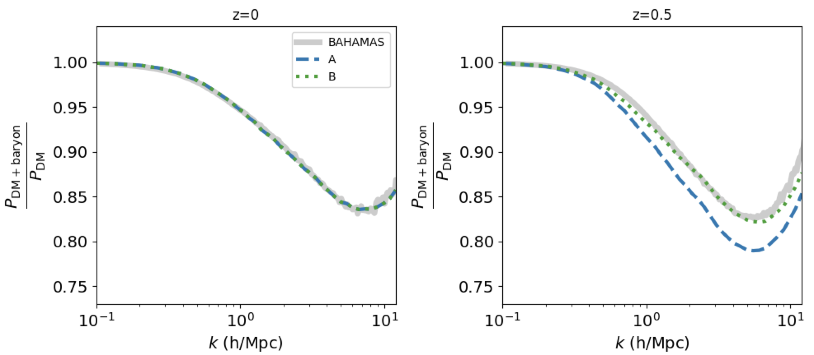

# BCMemu

A python package for modelling baryonic effects in cosmological simulations.

## Package details

The package provides conatins emulators to model the suppression in the power spectrum due to baryonic feedback processes. These emulators are based on the baryonification model [[1]](#1), where gravity-only *N*-body simulation results are manipulated to include the impact of baryonic feedback processes. 

## INSTALLATION

To install the package from source, one should clone this package running the following::

    git clone https://github.com/sambit-giri/BCMemu.git

To install the package in the standard location, run the following in the root directory::

    python setup.py install

In order to install it in a separate directory::

    python setup.py install --home=directory

One can also install it using pip by running the following command::

    pip install git+https://github.com/sambit-giri/BCMemu.git

The dependencies should be installed automatically during the installation process. If they fail for some reason, you can install them manually before installing BCMemu. The list of required packages can be found in the requirements.txt file present in the root directory.

### Tests

For testing, one can use [pytest](https://docs.pytest.org/en/stable/) or [nosetests](https://nose.readthedocs.io/en/latest/). Both packages can be installed using pip. To run all the test script, run the either of the following::

    python -m pytest tests
    
	nosetests -v

## USAGE

Script to get the baryonic power suppression.

```python
import numpy as np 
import matplotlib.pyplot as plt
import BCMemu

bfcemu = BCMemu.BCM_7param(Ob=0.05, Om=0.27)
bcmdict = {'log10Mc': 13.32,
           'mu'     : 0.93,
           'thej'   : 4.235,  
           'gamma'  : 2.25,
           'delta'  : 6.40,
           'eta'    : 0.15,
           'deta'   : 0.14,
           }

z = 0
k_eval = 10**np.linspace(-1,1.08,50)
p_eval = bfcemu.get_boost(z, bcmdict, k_eval)

plt.semilogx(k_eval, p_eval, c='C0', lw=3)
plt.axis([1e-1,12,0.73,1.04])
plt.yticks(fontsize=14)
plt.xticks(fontsize=14)
plt.xlabel(r'$k$ (h/Mpc)', fontsize=14)
plt.ylabel(r'$\frac{P_{\rm DM+baryon}}{P_{\rm DM}}$', fontsize=21)
plt.tight_layout()
plt.show()

```


The package also has a three parameter barynification model. Below an example fit to the BAHAMAS simulation result is shown. Model A assumes all the three parameters to be independent of redshift while model B assumes the parameters to be redshift dependent .

```python
import numpy as np 
import matplotlib.pyplot as plt
import BCMemu
import pickle

BAH = pickle.load(open('examples/BAHAMAS_data.pkl', 'rb'))

bfcemu = BCMemu.BCM_3param(Ob=0.0463, Om=0.2793)
bcmdict = {'log10Mc': 13.25, 
           'thej'   : 4.711,  
           'deta'   : 0.097}

zs = [0,0.5]
k_eval  = 10**np.linspace(-1,1.08,50)
p0_eval1 = bfcemu.get_boost(zs[0], bcmdict, k_eval)
p1_eval1 = bfcemu.get_boost(zs[1], bcmdict, k_eval)

bfcemu = BCMemu.BCM_3param(Ob=0.0463, Om=0.2793)
bcmdict = {'log10Mc': 13.25, 
           'thej'   : 4.711,  
           'deta'   : 0.097,
           'nu_Mc'  : 0.038,
           'nu_thej': 0.0,
           'nu_deta': 0.060}

zs = [0,0.5]
k_eval  = 10**np.linspace(-1,1.08,50)
p0_eval2 = bfcemu.get_boost(zs[0], bcmdict, k_eval)
p1_eval2 = bfcemu.get_boost(zs[1], bcmdict, k_eval)

plt.figure(figsize=(10,4.5))
plt.subplot(121); plt.title('z=0')
plt.semilogx(BAH['z=0']['k'], BAH['z=0']['S'], '-', c='k', lw=5, alpha=0.2, label='BAHAMAS')
plt.semilogx(k_eval, p0_eval1, c='C0', lw=3, label='A', ls='--')
plt.semilogx(k_eval, p0_eval1, c='C2', lw=3, label='B', ls=':')
plt.axis([1e-1,12,0.73,1.04])
plt.yticks(fontsize=14)
plt.xticks(fontsize=14)
plt.legend()
plt.xlabel(r'$k$ (h/Mpc)', fontsize=14)
plt.ylabel(r'$\frac{P_{\rm DM+baryon}}{P_{\rm DM}}$', fontsize=21)
plt.subplot(122); plt.title('z=0.5')
plt.semilogx(BAH['z=0.5']['k'], BAH['z=0.5']['S'], '-', c='k', lw=5, alpha=0.2, label='BAHAMAS')
plt.semilogx(k_eval, p1_eval1, c='C0', lw=3, label='A', ls='--')
plt.semilogx(k_eval, p1_eval2, c='C2', lw=3, label='B', ls=':')
plt.axis([1e-1,12,0.73,1.04])
plt.yticks(fontsize=14)
plt.xticks(fontsize=14)
plt.xlabel(r'$k$ (h/Mpc)', fontsize=14)
plt.ylabel(r'$\frac{P_{\rm DM+baryon}}{P_{\rm DM}}$', fontsize=21)
plt.tight_layout()
plt.show()


```




## CONTRIBUTING

If you find any bugs or unexpected behavior in the code, please feel free to open a [Github issue](https://github.com/sambit-giri/BCMemu/issues). The issue page is also good if you seek help or have suggestions for us. 

## References
<a id="1">[1]</a> 
Schneider, A., Teyssier, R., Stadel, J., Chisari, N. E., Le Brun, A. M., Amara, A., & Refregier, A. (2019). Quantifying baryon effects on the matter power spectrum and the weak lensing shear correlation. Journal of Cosmology and Astroparticle Physics, 2019(03), 020.
